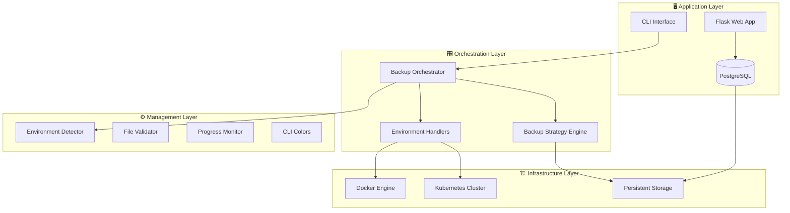
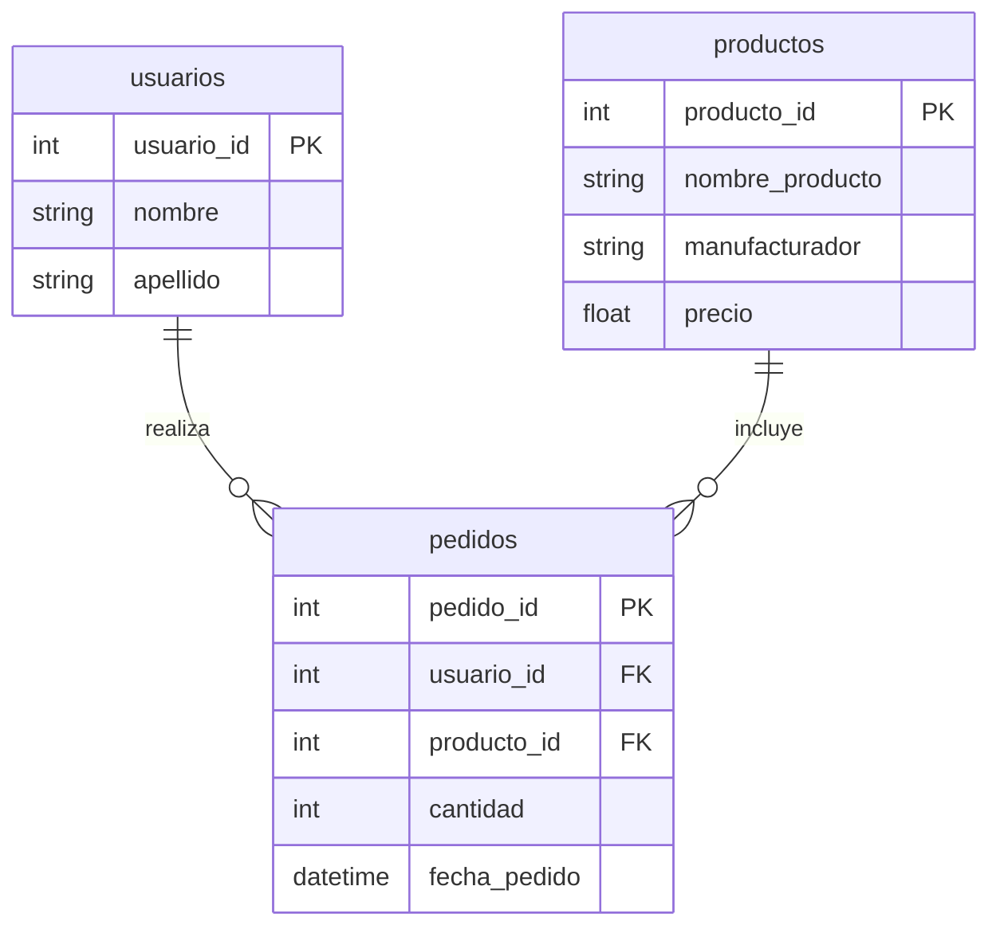

# Orquestador de Backups y Restauración

[](https://github.com/AlesxanDer1102/Practica-calificada4-Grupo5/actions/workflows/ci.yaml)
[](https://www.python.org/downloads/)
[](https://www.docker.com/)
[](https://kubernetes.io/)

> **Sistema inteligente de backups para PostgreSQL en entornos containerizados**

Una herramienta robusta y flexible que automatiza la copia de seguridad y restauración de bases de datos PostgreSQL en contenedores Docker y pods Kubernetes, con estrategias inteligentes de backup y políticas de retención configurables.

## 🚀 Características Principales

- **🎯 Multi-Entorno**: Soporte nativo para Docker y Kubernetes con detección automática
- **🧠 Estrategias Inteligentes**: Backup completo e incremental con decisión automática
- **📅 Políticas de Retención**: Gestión automática por categorías (daily, weekly, monthly, full)
- **🔒 Seguridad**: Validación de integridad y confirmación obligatoria para restauraciones
- **⚡ CLI Intuitiva**: Interfaz de línea de comandos con colores y progreso visual
- **🔧 Extensible**: Arquitectura modular preparada para nuevos entornos y estrategias

## 📋 Inicio Rápido

### Prerrequisitos

- Python 3.10+
- Docker o Kubernetes
- PostgreSQL ejecutándose en contenedor/pod

### Instalación

```bash
# Clonar repositorio
git clone https://github.com/AlesxanDer1102/Practica-calificada4-Grupo5.git
cd Practica-calificada4-Grupo5

# Configurar entorno
python3 -m venv .venv
source .venv/bin/activate
pip install -r requirements.txt
```

### Uso Básico

```bash
# Backup automático (estrategia inteligente)
python3 backup_orchestrator.py

# Backup con nombre personalizado
python3 backup_orchestrator.py --name "mi_backup_especial"

# Listar backups disponibles
python3 backup_orchestrator.py --list

# Restauración interactiva
python3 backup_orchestrator.py --restore
```

## 🏗️ Arquitectura del Sistema



## 📚 Documentación Completa

### 📖 Guías Principales

- **[🏗️ Arquitectura del Sistema](docs/architecture.md)** - Diagramas y patrones de diseño
- **[📖 Referencia de APIs y Comandos](docs/api-reference.md)** - Documentación completa de comandos
- **[👤 Guía de Usuario](docs/user-guide.md)** - Ejemplos prácticos y casos de uso
- **[⚖️ Docker vs Kubernetes](docs/docker-vs-kubernetes.md)** - Comparación detallada de entornos

### 🚦 Enlaces Rápidos

- [Instalación y Configuración](#configuración-del-entorno)
- [Comandos Básicos](#comandos-principales)
- [Estrategias de Backup](#estrategias-de-backup)
- [Políticas de Retención](#políticas-de-retención)
- [Resolución de Problemas](#resolución-de-problemas)

## 🎯 Estrategias de Backup

### Backup Inteligente (Recomendado)

```bash
# El sistema decide automáticamente el tipo óptimo
python3 backup_orchestrator.py --verbose
```

**Criterios de Decisión**:
- **Full**: Si no existe backup completo previo o han pasado >7 días
- **Incremental**: Si hay backup completo reciente y <5 incrementales

### Estrategias Específicas

```bash
# Forzar backup completo
python3 backup_orchestrator.py --force-full

# Backup incremental
python3 backup_orchestrator.py --backup-type incremental

# Backup completo con nombre específico
python3 backup_orchestrator.py --force-full --name "pre_migration"
```

## 📅 Políticas de Retención

### Configuración por Defecto

| Categoría | Límite | Descripción |
|-----------|--------|-------------|
| **Daily** | 7 backups | Backups regulares (lunes-sábado) |
| **Weekly** | 4 backups | Backups creados en domingo |
| **Monthly** | 12 backups | Backups creados el día 1 del mes |
| **Full** | 3 backups | Todos los backups completos |

### Configuración Personalizada

```bash
# Configurar límites específicos
python3 backup_orchestrator.py \
  --retention-daily 15 \
  --retention-weekly 8 \
  --retention-monthly 24 \
  --retention-full 10

# Aplicar políticas de retención
python3 backup_orchestrator.py --apply-retention
```

## 🌍 Soporte Multi-Entorno

### Docker

```bash
# Backup en contenedor Docker
python3 backup_orchestrator.py --container postgres_container

# Con Docker Compose
docker-compose up -d
python3 backup_orchestrator.py
```

### Kubernetes

```bash
# Backup en pod Kubernetes
python3 backup_orchestrator.py --pod postgres-0 --namespace production

# Multi-namespace
for ns in dev staging prod; do
  python3 backup_orchestrator.py --pod postgres-0 --namespace $ns
done
```

## 🔧 Configuración del Entorno

### Variables de Entorno

```bash
# Configuración básica
export POSTGRES_USER=postgres
export POSTGRES_PASSWORD=mi_password
export POSTGRES_DB=mi_base_datos
export BACKUP_DIR=./backups

# Configuración de retención
export RETENTION_DAILY=7
export RETENTION_WEEKLY=4
export RETENTION_MONTHLY=12
export RETENTION_FULL=3
```

### Docker Compose

```yaml
version: '3.8'
services:
  postgres:
    image: postgres:15
    container_name: postgres_container
    environment:
      POSTGRES_USER: postgres
      POSTGRES_PASSWORD: 12345
      POSTGRES_DB: pc_db
    volumes:
      - postgres_data:/var/lib/postgresql/data
      - ./backups:/backups
    ports:
      - "5432:5432"

volumes:
  postgres_data:
```

## 📋 Comandos Principales

### Operaciones de Backup

```bash
# Backup básico
python3 backup_orchestrator.py

# Con configuraciones específicas
python3 backup_orchestrator.py \
  --name "backup_critico" \
  --force-full \
  --verbose

# En directorio personalizado
python3 backup_orchestrator.py --dir /custom/path/backups
```

### Gestión de Backups

```bash
# Listar backups
python3 backup_orchestrator.py --list

# Listar con detalles
python3 backup_orchestrator.py --list --verbose

# Información del sistema
python3 backup_orchestrator.py --info
```

### Restauración

```bash
# Restauración interactiva
python3 backup_orchestrator.py --restore

# Restaurar archivo específico
python3 backup_orchestrator.py \
  --restore \
  --restore-file backups/mi_backup.sql

# Restauración silenciosa
python3 backup_orchestrator.py --restore --quiet
```

## 🔬 Aplicación de Demostración

El proyecto incluye una aplicación Flask de demostración que implementa un sistema CRUD básico:

### Modelo de Datos



### Uso de la Aplicación

```bash
# Inicializar base de datos
docker-compose up -d

# Ejecutar aplicación
python3 app.py

# Crear backup de datos de la app
python3 backup_orchestrator.py --name "app_data"
```

## 🧪 Testing

### Ejecutar Tests

```bash
# Tests completos con cobertura
pytest --cov=backup_orchestrator --cov=backup_cli --cov-report=html

# Tests específicos
pytest tests/test_backup_orchestrator.py -v

# Tests de integración
pytest tests/test_integration_* -v
```

### Cobertura Actual

- **Total**: 52% de cobertura de código
- **Tests**: 112/113 passing (99.1% success rate)
- **Componentes**: Todos los módulos principales cubiertos

## 🔍 Resolución de Problemas

### Errores Comunes

#### "Container not found"

```bash
# Verificar contenedores disponibles
docker ps

# Usar nombre correcto
python3 backup_orchestrator.py --container nombre_correcto
```

#### "Permission denied"

```bash
# Verificar permisos del directorio
ls -la backups/

# Crear directorio con permisos correctos
mkdir -p backups && chmod 755 backups
```

#### "Database connection failed"

```bash
# Verificar que el contenedor esté ejecutándose
docker exec -it postgres_container psql -U postgres -l

# Verificar variables de entorno
echo $POSTGRES_USER $POSTGRES_DB
```

### Logging y Debug

```bash
# Modo verbose para más información
python3 backup_orchestrator.py --verbose

# Verificar logs del contenedor
docker logs postgres_container

# Información del sistema
python3 backup_orchestrator.py --info
```

## 🤝 Contribución

### Desarrollo

```bash
# Configurar entorno de desarrollo
git clone https://github.com/AlesxanDer1102/Practica-calificada4-Grupo5.git
cd Practica-calificada4-Grupo5
python3 -m venv .venv
source .venv/bin/activate
pip install -r requirements.txt

# Ejecutar tests
pytest

# Verificar formateo
black --check .
isort --check-only .
flake8 .
```

### Arquitectura Extensible

- **Nuevos Entornos**: Implementar nueva clase `Handler`
- **Nuevas Estrategias**: Extender `BackupStrategy`
- **Nuevas Interfaces**: Utilizar `UnifiedBackupOrchestrator` existente

## 📄 Licencia

Este proyecto está bajo la licencia MIT. Ver [LICENSE](LICENSE) para más detalles.

## 🙋 Soporte

- **Documentación**: Ver [docs/](docs/) para guías detalladas
- **Issues**: [GitHub Issues](https://github.com/AlesxanDer1102/Practica-calificada4-Grupo5/issues)
- **Ejemplos**: Ver [docs/user-guide.md](docs/user-guide.md) para casos de uso

---

**Desarrollado con ❤️ para simplificar las operaciones de backup en entornos containerizados**
