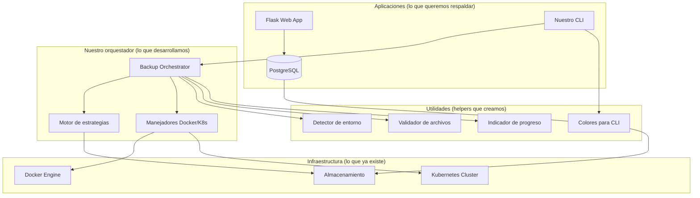
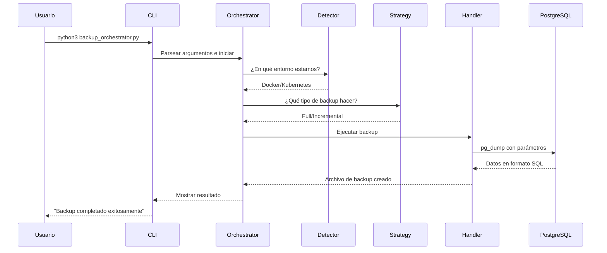

# Arquitectura del Sistema

## Como organizamos el proyecto

Diseñamos el **Orquestador de Backups** usando una arquitectura de 4 capas que nos permite trabajar tanto con Docker como con Kubernetes sin cambiar código.

## Diagrama principal de como funciona

## Las 4 capas que definimos

### 1. Capa de Infraestructura
**Qué es**: El entorno donde corre todo (Docker, Kubernetes, discos)
**Por qué**: No lo controlamos nosotros, pero nuestro código debe adaptarse

**Componentes**:
- **Docker Engine**: Para desarrollo local
- **Kubernetes Cluster**: Para ambientes más complejos  
- **Almacenamiento**: Donde se guardan datos y backups

### 2. Capa de Aplicación
**Qué es**: Las aplicaciones que queremos respaldar
**Por qué**: Son el objetivo del backup, no las desarrollamos nosotros

**Componentes**:
- **Flask Web App**: Aplicación de ejemplo del proyecto
- **CLI Interface**: Nuestro punto de entrada
- **PostgreSQL**: La base de datos que respaldamos

### 3. Capa de Orquestación 
**Qué es**: La lógica principal que desarrollamos
**Por qué**: Aquí está toda la inteligencia del sistema

**Componentes**:
- **Backup Orchestrator**: El controlador principal
- **Strategy Engine**: Decide qué tipo de backup hacer
- **Environment Handlers**: Adaptadores para Docker/K8s

### 4. Capa de Gestión
**Qué es**: Utilidades y herramientas de soporte
**Por qué**: Hacen que el sistema sea más fácil de usar

**Componentes**:
- **Environment Detector**: Detecta si estamos en Docker o K8s
- **File Validator**: Valida nombres y archivos
- **Progress Monitor**: Muestra barras de progreso
- **CLI Colors**: Hace la salida más legible

## Como fluyen los datos

## Patrones de diseño que usamos

### 1. Strategy Pattern
- **Dónde**: Clase `BackupStrategy`
- **Por qué**: Para manejar diferentes tipos de backup (full/incremental)
- **Ventaja**: Fácil agregar nuevos tipos sin cambiar código existente

### 2. Factory Pattern  
- **Dónde**: `EnvironmentDetector` + selección de `Handler`
- **Por qué**: Para crear el handler correcto según el entorno
- **Ventaja**: El código principal no necesita saber si es Docker o K8s

### 3. Command Pattern
- **Dónde**: Comandos del CLI
- **Por qué**: Para encapsular cada operación como objeto
- **Ventaja**: Fácil testing y agregar nuevos comandos

### 4. Observer Pattern
- **Dónde**: `ProgressIndicator` 
- **Por qué**: Para mostrar progreso sin bloquear la lógica principal
- **Ventaja**: UI separada de la lógica de backup

### Estrategia automática con override manual
- **Decisión**: El sistema decide automáticamente, pero se puede forzar
- **Por qué**: Balance entre facilidad de uso y control del usuario
- **Como**: Heurísticas en `BackupStrategy` con flags para override

### CLI primero, API preparado
- **Decisión**: Interfaz CLI como prioridad, pero código preparado para APIs
- **Por qué**: Proyecto pide CLI, pero queremos que sea extensible  
- **Como**: Separación clara entre UI y lógica de negocio

## Como extender el sistema

### Agregar un nuevo entorno (ej: Podman)
1. Crear nueva clase `PodmanHandler` heredando de base
2. Implementar métodos `execute_command()` y `check_container_status()`  
3. Agregar detección en `EnvironmentDetector`
4. Agregar tests específicos

### Agregar nueva estrategia de backup
1. Extender `BackupStrategy` con nueva lógica
2. Implementar método `determine_backup_type()`
3. Actualizar metadatos y configuración
4. Agregar tests para nueva estrategia

### Agregar interfaz web
1. Crear nueva capa de UI (Flask/FastAPI)
2. Usar `UnifiedBackupOrchestrator` existente como backend
3. Mantener separación de responsabilidades
4. Reutilizar toda la lógica actual

## Consideraciones de seguridad que implementamos

### Validación de entrada
- Sanitización de nombres de archivo
- Validación de rutas de backup  
- Verificación de permisos de contenedor

### Manejo de credenciales
- Variables de entorno para configuración
- No hardcodear passwords en código
- Usar secrets de Kubernetes cuando sea posible

### Integridad de datos
- Verificación de integridad de backups
- Confirmación obligatoria para restauraciones
- Logging detallado de operaciones críticas

