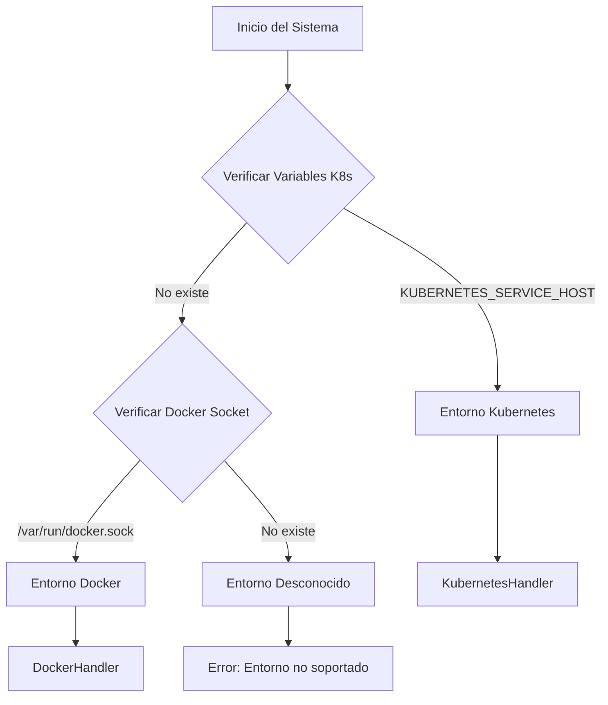

# Docker vs Kubernetes - Lo que aprendimos

## Como funciona en ambos entornos

Nuestro **Orquestador de Backups** funciona igual en Docker y Kubernetes. Durante el desarrollo tuvimos que entender bien las diferencias para que el código funcione en ambos sin cambios.

## Comparación General

| Aspecto | Docker | Kubernetes |
|---------|--------|------------|
| **Complejidad** | Simple, directo | Complejo, robusto |
| **Escalabilidad** | Limitada | Alta |
| **Orquestación** | Manual/Docker Compose | Automática |
| **Persistencia** | Volúmenes Docker | PersistentVolumes |
| **Networking** | Bridge/Host | CNI, Services |
| **Monitoreo** | Logs básicos | Métricas avanzadas |
| **Ideal para** | Desarrollo, testing | Producción, scaling |

## Detección Automática de Entorno

### Cómo Funciona



### Como probarlo

```bash
# Ver qué entorno detecta el sistema
python3 backup_orchestrator.py --list

# Si está en Docker con backups:
# Archivos de backup en ./backups:
# backup_20240630.sql    2.1 MB    2024-06-30 14:25:30

# Si está en Kubernetes:
# (funciona igual, detecta automáticamente)
```

## Docker - Lo que nos funcionó para desarrollo

### Por qué usamos Docker

1. **Simple de configurar**: Solo `docker-compose up` y listo
2. **Perfecto para desarrollo**: Cada uno en su máquina local
3. **Fácil debuggear**: Logs directos y acceso simple
4. **Menos recursos**: No necesita cluster completo

### Configuración Docker

```bash
# docker-compose.yml
version: '3.8'
services:
  postgres:
    image: postgres:15
    container_name: postgres_container
    environment:
      POSTGRES_USER: postgres
      POSTGRES_PASSWORD: 12345
      POSTGRES_DB: pc_db
    volumes:
      - postgres_data:/var/lib/postgresql/data
      - ./backups:/backups
    ports:
      - "5432:5432"

volumes:
  postgres_data:
```

### Comandos Docker Específicos

```bash
# Backup básico
python3 backup_orchestrator.py

# Especificar contenedor
python3 backup_orchestrator.py --container mi_postgres

# Verificar contenedores disponibles
docker ps
```

### Implementación Interna Docker

```python
# Ejecución de comandos en Docker
def execute_command(self, container_name, command):
    cmd = ["docker", "exec", container_name] + command
    return subprocess.run(cmd, capture_output=True, text=True)

# Verificación de contenedor
def check_container_status(self, container_name):
    cmd = ["docker", "inspect", container_name]
    result = subprocess.run(cmd, capture_output=True)
    return result.returncode == 0
```

### Casos de Uso Docker

#### 1. Desarrollo Local

```bash
# Levantar ambiente
docker-compose up -d

# Backup de desarrollo
python3 backup_orchestrator.py --name "dev_backup"

# Limpiar ambiente
docker-compose down -v
```

#### 2. Testing de Aplicaciones

```bash
# Crear datos de prueba
docker exec -it postgres_container psql -U postgres -d pc_db -c "
INSERT INTO usuarios (nombre, apellido) VALUES ('Test', 'User');
"

# Backup antes de tests
python3 backup_orchestrator.py --name "pre_test"

# Restaurar estado limpio
python3 backup_orchestrator.py --restore --restore-file backups/pre_test.sql
```

#### 3. Demostración/POC

```bash
# Setup rápido para demo
docker run -d \
  --name demo_postgres \
  -e POSTGRES_USER=demo \
  -e POSTGRES_PASSWORD=demo123 \
  -e POSTGRES_DB=demo_db \
  -p 5432:5432 \
  postgres:15

# Backup de demo
python3 backup_orchestrator.py --container demo_postgres --name "demo"
```

## Kubernetes - Para casos más complejos

### Cuándo vale la pena Kubernetes

1. **Escalabilidad**: Cuando necesitas crecer automáticamente
2. **Alta disponibilidad**: Para ambientes críticos de producción
3. **Gestión de recursos**: Control fino de CPU/memoria
4. **Seguridad avanzada**: RBAC, network policies, secrets
5. **Monitoreo**: Métricas y observabilidad completa

### Configuración Kubernetes

```yaml
# postgres-deployment.yaml
apiVersion: apps/v1
kind: Deployment
metadata:
  name: postgres
spec:
  replicas: 1
  selector:
    matchLabels:
      app: postgres
  template:
    metadata:
      labels:
        app: postgres
    spec:
      containers:
      - name: postgres
        image: postgres:15
        env:
        - name: POSTGRES_USER
          value: "postgres"
        - name: POSTGRES_PASSWORD
          valueFrom:
            secretKeyRef:
              name: postgres-secret
              key: password
        - name: POSTGRES_DB
          value: "pc_db"
        volumeMounts:
        - name: postgres-storage
          mountPath: /var/lib/postgresql/data
        - name: backup-storage
          mountPath: /backups
      volumes:
      - name: postgres-storage
        persistentVolumeClaim:
          claimName: postgres-pvc
      - name: backup-storage
        persistentVolumeClaim:
          claimName: backup-pvc
```

### Comandos Kubernetes Específicos

```bash
# Backup básico (detección automática)
python3 backup_orchestrator.py

# Especificar pod y namespace
python3 backup_orchestrator.py \
  --pod postgres-0 \
  --namespace production

# Backup en StatefulSet
python3 backup_orchestrator.py \
  --pod postgres-primary-0 \
  --namespace database

# Verificar pods disponibles
kubectl get pods
```

### Implementación Interna Kubernetes

```python
# Ejecución de comandos en Kubernetes
def execute_command(self, pod_name, command, namespace="default"):
    cmd = ["kubectl", "exec", f"{pod_name}", 
           "-n", namespace, "--"] + command
    return subprocess.run(cmd, capture_output=True, text=True)

# Verificación de pod
def check_pod_status(self, pod_name, namespace="default"):
    cmd = ["kubectl", "get", "pod", pod_name, "-n", namespace]
    result = subprocess.run(cmd, capture_output=True)
    return result.returncode == 0
```

### Casos de Uso Kubernetes

#### 1. Producción con Alta Disponibilidad

```bash
# Backup de producción
python3 backup_orchestrator.py \
  --pod postgres-primary-0 \
  --namespace production \
  --force-full \
  --name "prod_backup_$(date +%Y%m%d)"

# Configurar retención para producción
python3 backup_orchestrator.py \
  --retention-daily 30 \
  --retention-weekly 12 \
  --retention-monthly 24 \
  --apply-retention
```

#### 2. Multi-Entorno (Dev/Staging/Prod)

```bash
# Script para backup en múltiples namespaces
#!/bin/bash
for env in development staging production; do
  echo "Backing up $env environment..."
  python3 backup_orchestrator.py \
    --pod postgres-0 \
    --namespace $env \
    --name "${env}_$(date +%Y%m%d)" \
    --verbose
done
```

#### 3. Backup Programado con CronJob

```yaml
apiVersion: batch/v1
kind: CronJob
metadata:
  name: postgres-backup
  namespace: production
spec:
  schedule: "0 2 * * *"
  jobTemplate:
    spec:
      template:
        spec:
          containers:
          - name: backup
            image: backup-orchestrator:latest
            command:
            - /bin/sh
            - -c
            - |
              python3 backup_orchestrator.py \
                --pod postgres-primary-0 \
                --namespace production \
                --name "scheduled_$(date +%Y%m%d_%H%M)" \
                --quiet
            volumeMounts:
            - name: backup-storage
              mountPath: /backups
          volumes:
          - name: backup-storage
            persistentVolumeClaim:
              claimName: backup-pvc
          restartPolicy: OnFailure
```

## Configuraciones Específicas por Entorno

### Variables de Entorno

#### Docker

```bash
# Configuración Docker
export CONTAINER_NAME=postgres_container
export BACKUP_DIR=./backups
export POSTGRES_USER=postgres
export POSTGRES_DB=pc_db
```

#### Kubernetes

```bash
# Configuración Kubernetes
export POD_NAME=postgres-0
export NAMESPACE=default
export BACKUP_DIR=/backups
export KUBECONFIG=/path/to/config
```

### Almacenamiento Persistente

#### Docker Volumes

```yaml
# docker-compose.yml
volumes:
  postgres_data:
    driver: local
  backup_storage:
    driver: local
    driver_opts:
      type: bind
      device: /host/backups
      o: bind
```

#### Kubernetes PersistentVolumes

```yaml
# backup-pvc.yaml
apiVersion: v1
kind: PersistentVolumeClaim
metadata:
  name: backup-pvc
spec:
  accessModes:
    - ReadWriteOnce
  resources:
    requests:
      storage: 100Gi
  storageClassName: fast-ssd
```

### Networking

#### Docker

```bash
# Red Docker (bridge por defecto)
docker network create backup_network

# Conectar contenedores
docker run --network backup_network postgres:15
```

#### Kubernetes

```yaml
# Service para acceso interno
apiVersion: v1
kind: Service
metadata:
  name: postgres-service
spec:
  selector:
    app: postgres
  ports:
  - port: 5432
    targetPort: 5432
```

## Migración entre Entornos

### Docker → Kubernetes

```bash
# 1. Backup en Docker
python3 backup_orchestrator.py \
  --container postgres_container \
  --force-full \
  --name "migration_backup"

# 2. Copiar backup a Kubernetes
kubectl cp backups/migration_backup.sql \
  postgres-0:/tmp/migration_backup.sql

# 3. Restaurar en Kubernetes
python3 backup_orchestrator.py \
  --restore \
  --pod postgres-0 \
  --restore-file /tmp/migration_backup.sql
```

### Kubernetes → Docker

```bash
# 1. Backup en Kubernetes
python3 backup_orchestrator.py \
  --pod postgres-0 \
  --namespace production \
  --force-full \
  --name "k8s_to_docker"

# 2. Copiar desde Kubernetes
kubectl cp production/postgres-0:/backups/k8s_to_docker.sql \
  ./backups/k8s_to_docker.sql

# 3. Restaurar en Docker
python3 backup_orchestrator.py \
  --restore \
  --container postgres_container \
  --restore-file backups/k8s_to_docker.sql
```

## Comparación de Comandos

### Operaciones Básicas

| Operación | Docker | Kubernetes |
|-----------|--------|------------|
| **Listar contenedores/pods** | `docker ps` | `kubectl get pods` |
| **Ver logs** | `docker logs container` | `kubectl logs pod` |
| **Ejecutar comando** | `docker exec -it container cmd` | `kubectl exec -it pod -- cmd` |
| **Inspeccionar** | `docker inspect container` | `kubectl describe pod` |

### Backup Específico

| Operación | Docker | Kubernetes |
|-----------|--------|------------|
| **Backup básico** | `python3 backup_orchestrator.py` | `python3 backup_orchestrator.py` |
| **Especificar target** | `--container name` | `--pod name --namespace ns` |
| **Ver disponibles** | `docker ps` | `kubectl get pods -n namespace` |

## Consideraciones de Rendimiento

### Docker

- **Overhead mínimo**: Acceso directo al socket Docker
- **Red simple**: Bridge networking
- **I/O directo**: Acceso directo a volúmenes
- **Ideal para**: Desarrollo, testing, single-node

### Kubernetes

- **Overhead adicional**: Capas de abstracción
- **Red compleja**: CNI, services, ingress
- **I/O distribuido**: Storage classes, CSI drivers
- **Ideal para**: Producción, multi-node, scaling

## Seguridad

### Docker

```bash
# Usuario no-root en contenedor
docker run --user 1000:1000 postgres:15

# Volumes read-only donde sea posible
docker run -v /backups:/backups:ro backup-app
```

### Kubernetes

```yaml
# Security Context
securityContext:
  runAsNonRoot: true
  runAsUser: 1000
  fsGroup: 2000
  capabilities:
    drop:
    - ALL

# RBAC para backup
apiVersion: rbac.authorization.k8s.io/v1
kind: Role
metadata:
  name: backup-role
rules:
- apiGroups: [""]
  resources: ["pods"]
  verbs: ["get", "list"]
- apiGroups: [""]
  resources: ["pods/exec"]
  verbs: ["create"]
```

## Monitoreo y Observabilidad

### Docker

```bash
# Logs básicos
docker logs postgres_container

# Métricas básicas
docker stats postgres_container

# Health checks
docker exec postgres_container pg_isready
```

### Kubernetes

```yaml
# Liveness probe
livenessProbe:
  exec:
    command:
    - pg_isready
    - -U
    - postgres
  initialDelaySeconds: 30
  periodSeconds: 10

# Readiness probe
readinessProbe:
  exec:
    command:
    - pg_isready
    - -U
    - postgres
  initialDelaySeconds: 5
  periodSeconds: 5
```

## Recomendaciones por Escenario

### Usar Docker cuando:

- **Desarrollo local** individual
- **Prototipado rápido** de aplicaciones
- **Testing** de componentes aislados
- **Aplicaciones simples** single-node
- **Learning/Training** de la herramienta

### Usar Kubernetes cuando:

- **Producción** con alta disponibilidad
- **Aplicaciones distribuidas** multi-componente
- **Scaling automático** requerido
- **Múltiples entornos** (dev/staging/prod)
- **Compliance** y auditoría necesarios
- **Team collaboration** con DevOps 