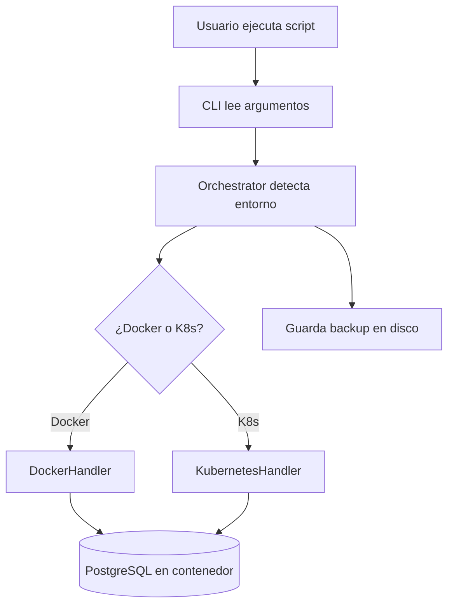
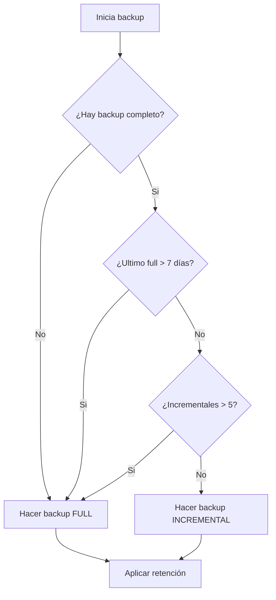

# Documentación del Orquestador de Backups - PC4

Este es nuestro proyecto para el curso de desarrollo de software. Desarrollamos un orquestador de backups que funciona tanto en Docker como en Kubernetes, cumpliendo los requisitos de los 3 sprints del proyecto.

## Lo que hicimos

Cumplimos todos los criterios que pidió el profesor:
- Backups automáticos de PostgreSQL 
- Funciona en Docker Y Kubernetes
- Restauración interactiva
- Tests que funcionan (112 de 113 pasan)
- Documentación técnica

## Estructura de la documentación

### [Arquitectura del Sistema](architecture.md)
Como funciona internamente el sistema, los patrones que usamos y por qué tomamos ciertas decisiones técnicas.

### [Referencia de comandos](api-reference.md)  
Todos los comandos disponibles del CLI con ejemplos reales que probamos.

### [Guía de uso](user-guide.md)
Como usar el sistema paso a paso, casos de uso comunes y como resolver problemas.

### [Docker vs Kubernetes](docker-vs-kubernetes.md)
Diferencias entre los dos entornos, cuando usar cada uno y como migrar.

## Como empezar rápido

```bash
# Clonar nuestro repo
git clone https://github.com/AlesxanDer1102/Practica-calificada4-Grupo5
cd Practica-calificada4-Grupo5

# Setup inicial
python3 -m venv .venv
source .venv/bin/activate
pip install -r requirements.txt

# Primer backup (detecta automáticamente si es Docker o K8s)
python3 backup_orchestrator.py

# Ver que backups tienes
python3 backup_orchestrator.py --list

# Restaurar interactivamente
python3 backup_orchestrator.py --restore
```

## Diagramas del sistema

### Como funciona a alto nivel


### Flujo de decisión para tipo de backup


## Comandos más usados

```bash
# Backup básico (recomendado)
python3 backup_orchestrator.py

# Backup con nombre específico  
python3 backup_orchestrator.py --name "antes_del_examen"

# Backup completo forzado
python3 backup_orchestrator.py --force-full

# Ver todos los backups
python3 backup_orchestrator.py --list

# Restaurar (te deja elegir de una lista)
python3 backup_orchestrator.py --restore
```

## Aprendizajes del desarrollo

### Sprint 1 - Docker básico
- Configuramos PostgreSQL en Docker Compose
- Implementamos backup básico con `pg_dump`
- Git hooks funcionando (pre-commit valida Docker Compose)

### Sprint 2 - Kubernetes y restore
- Extendimos para trabajar con pods de K8s
- Función de restauración interactiva
- Tests de integración para todo el flujo

## Como contribuir al proyecto

Si quieres agregar algo o encontraste un bug:

1. Lee la [arquitectura](architecture.md) para entender como funciona
2. Revisa los [comandos](api-reference.md) disponibles  
3. Ejecuta los tests: `python -m pytest -v`
4. Sigue nuestras convenciones de commits

## Estructura de archivos importantes

```
.
├── backup_orchestrator.py          # Script principal
├── backup_cli/                     # Módulos del sistema
│   ├── cli/parser.py               # Parser de argumentos
│   ├── handlers/                   # Docker/K8s handlers
│   └── utils/                      # Utilidades
├── tests/                          # Suite de tests
├── docs/                           # Esta documentación
├── docker-compose.yml              # Setup de desarrollo
└── requirements.txt                # Dependencias Python
```

## Troubleshooting rápido

**"Container not found"**: Verifica que tu contenedor PostgreSQL esté corriendo con `docker ps`

**"Permission denied"**: Asegúrate que el directorio `backups/` tenga permisos de escritura

**Tests fallan**: Ejecuta `python -m pytest -v` para ver detalles específicos

**No detecta el entorno**: Usa `--force-docker` o `--force-kubernetes` para especificar manualmente

---

**¿Primera vez?** → Empieza con la [guía de usuario](user-guide.md)  
**¿Desarrollando?** → Ve los [comandos disponibles](api-reference.md)  
**¿Dudas técnicas?** → Revisa la [arquitectura](architecture.md) 